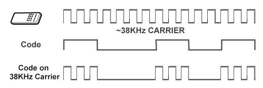

The below explanation assumes the reader is using Flipper Lab. 

Some fundamentals of IR remote control can be found [here](https://www.laser.com/dhouston/ir-rf_fundamentals.html).

Here, we seek answers to the following questions.

- [How can I capture an IR signal in the Flipper Zero CLI?](#how-can-i-capture-an-ir-signal-in-the-flipper-zero-cli)
- [How does the raw signal relate to the decoded message?](#how-does-the-raw-signal-relate-to-the-decoded-message)
- [How can I emulate a command with the Flipper Zero?](#how-can-i-emulate-a-command-with-the-flipper-zero)


## How can I capture an IR signal in the Flipper Zero CLI?

In the Flipper Zero CLI, I can e.g. capture the "Mute" command from my Edifier R1280DB remote in two different ways, see the [IR CLI documentation](https://docs.flipper.net/development/cli/#FEjwz).

1. `ir rx` reads and decodes IR data giving
```
NECext, A:0xE710, C:0xFF00
```

"NECext" is the protocol, "A" denotes the address, i.e. the intended recipient of the signal (the speakers), and "C" denotes the command. The protocol and address don't change for different commands. For instance, if I instead press the "Power" button, I get

```
NECext, A:0xE710, C:0xFE01
```


2. `ir rx raw` reads IR data in RAW format giving
```
RAW, 87 samples: 
8934 4472 554 557 553 555 555 555 555 557 555 1662 555 555 555 556 554 556 556 1663 554 1663 554 1661 556 558 554 555 555 1663 554 1661 556 1665 553 555 555 556 554 556 554 557 555 555 555 555 555 555 555 557 555 1662 555 1662 555 1662 555 1664 554 1662 555 1663 554 1662 555 1665 554 40944 8935 2237 552 95357 8937 2235 554 95360 8935 2236 554 95359 8934 2235 555 95361 8930 2269 521
```

We can plot the corresponding raw IR signal file `mute_raw.ir` (I'll explain how to build this in a bit.) in the Flipper Zero Pulse Plotter. 

 pulse plot of mute_raw.ir")

We see that every number of the raw data represents a duration (in microseconds) of alternating "high" and "low", i.e. 8934µs "high", 4472µs "low", 554µs "high", ... 

## How does the raw signal relate to the decoded message?

Here, the encoding is NECext, which is similar to (plain) NEC, see https://techdocs.altium.com/display/FPGA/NEC+Infrared+Transmission+Protocol.

I wasn't able to find a precise specification of the NECext protocol anywhere but the [implementation](https://github.com/flipperdevices/flipperzero-firmware/blob/21e7c46033b0a41a642e3fcb615edd850ae54c6f/lib/infrared/encoder_decoder/nec/infrared_protocol_nec.h) of the flipper-zero firmware actually gives us an idea, and so we can actually understand the raw data.

| signal part             |                         | raw      | message             |
| ----------------------- | ----------------------- | -------- | ------------------- |
| Begin                   |                         | 8934     | 9ms leading pulse   |
|                         |                         | 4472     | 4.5ms space         |
| 16-Bit Address (0xE710) | 16 = 0x10 = 0x00001000  | 554 557  | Logical '0'         |
|                         |                         | 553 555  | Logical '0'         |
|                         |                         | 555 555  | Logical '0'         |
|                         |                         | 555 557  | Logical '0'         |
|                         |                         | 555 1662 | Locical '1'         |
|                         |                         | 555 555  | Logical '0'         |
|                         |                         | 555 556  | Logical '0'         |
|                         |                         | 554 556  | Logical '0'         |
|                         | 231 = 0xE7 = 0b11100111 | 556 1663 | Logical '1'         |
|                         |                         | 554 1663 | Logical '1'         |
|                         |                         | 554 1661 | Logical '1'         |
|                         |                         | 556 558  | Logical '0'         |
|                         |                         | 554 555  | Logical '0'         |
|                         |                         | 555 1663 | Logical '1'         |
|                         |                         | 554 1661 | Logical '1'         |
|                         |                         | 556 1665 | Logical '1'         |
| 16-Bit Command (0xFF00) | 0 = 0x00 = 0x00000000   | 553 555  | Logical '0'         |
|                         |                         | 555 556  | Logical '0'         |
|                         |                         | 554 556  | Logical '0'         |
|                         |                         | 554 557  | Logical '0'         |
|                         |                         | 555 555  | Logical '0'         |
|                         |                         | 555 555  | Logical '0'         |
|                         |                         | 555 555  | Logical '0'         |
|                         |                         | 555 557  | Logical '0'         |
|                         | 255 = 0xFF = 0b11111111 | 555 1662 | Logical '1'         |
|                         |                         | 555 1662 | Logical '1'         |
|                         |                         | 555 1662 | Logical '1'         |
|                         |                         | 555 1664 | Logical '1'         |
|                         |                         | 554 1662 | Logical '1'         |
|                         |                         | 555 1663 | Logical '1'         |
|                         |                         | 554 1662 | Logical '1'         |
|                         |                         | 555 1665 | Logical '1'         |
| End                     |                         | 554      | 562.5µs pulse burst |
| Repeat                  |                         | 40944    | 40ms pause          |
|                         |                         | 8935     | 9ms leading pulse   |
|                         |                         | 2237     | 2.25ms space        |
|                         |                         | 552      | 562.5µs pulse burst |
| Repeat                  |                         | 95357    | 95ms pause          |
|                         |                         | 8937     | 9ms leading pulse   |
|                         |                         | 2235     | 2.25ms space        |
|                         |                         | 554      | 562.5µs pulse burst |
| Repeat                  |                         | 95360    | 95ms pause          |
|                         |                         | 8935     | 9ms leading pulse   |
|                         |                         | 2236     | 2.25ms space        |
|                         |                         | 554      | 562.5µs pulse burst |
| Repeat                  |                         | 95359    | 95ms pause          |
|                         |                         | 8934     | 9ms leading pulse   |
|                         |                         | 2235     | 2.25ms space        |
|                         |                         | 555      | 562.5µs pulse burst |
| Repeat                  |                         | 95361    | 95ms pause          |
|                         |                         | 8930     | 9ms leading pulse   |
|                         |                         | 2269     | 2.25ms space        |
|                         |                         | 521      | 562.5µs pulse burst |

We see that this signal is transmitted in [little endian](https://en.wikipedia.org/wiki/Endianness), i.e. the least significant bytes (and bits) come first.

## How can I emulate a command with the Flipper Zero?

We can, of course, use the information we have gathered thus far in order to emulate the IR signal, e.g. to use the Flipper Zero to send the "mute" command to my speakers. Again, there is a straight-forward high-level and a raw low-level functionality available according to the the [IR CLI documentation](https://docs.flipper.net/development/cli/#FEjwz).

1. `ir tx <protocol> <address> <command>`

Sends a command for a known protocol.

The argument `<protocol>` can be any one of `NEC`, `NECext`, `NEC42`, `NEC42ext`, `Samsung32`, `RC6`, `RC5`, `RC5X`, `SIRC`, `SIRC15`, `SIRC20`, `Kaseikyo` or `RCA`.

The arguments `<address>` and `<command>` must be provided in hex format.

In my case, if I wanted to emulate the "mute" signal from above, I would call `ir tx NECext 0xE710 0xFF00`. 

2. `ir tx RAW F:<frequency> DC:<duty_cycle> <samples>`

Sends a raw command. 

The argument `<frequency>` denotes the carrier frequency. It is given in Hz and can be any value between `10000` and `56000`. 

The argument `<DC>` refers to the duty cycle. This is a percentage that must be in the range `0`-`100`. 

> [!WARNING]
> The following explanation could very well be wrong but it makes sense to me and I have not been able to find anything that says otherwise.

The way I understand the carrier frequency and duty cycle, amongst others with [this explanation](https://www.bestmodulescorp.com/amfile/file/download/file_id/1939/product_id/797/) and [Wikipedia](https://en.wikipedia.org/wiki/Duty_cycle) is that, e.g. the first 8934µs "high" is not actually a continuous "high" because this would be hard to reliably measure in noisy environments. Whenever, there was a slight flickering, this could be perceived as a high-low-high transition. Instead, the "high" itself is intentionally "flickering" at the carrier frequency. This is also known as "modulation". For instance, for a carrier frequency of 1 MHz, which is equivalent to a 1µs period, we would see 8934 "high/low" cycles, during the 8934µs "high". The ratio of these "high" to "low" periods in one such "flickering" cycle is given by the duty cycle. For a 30% duty cycle, the "high" fraction would last 0.3µs and the "low" fraction would last 0.7µs.

This picture nicely summarizes the above attempt at an explanation.



*The correct specifications of both carrier frequency and duty cycle seem to primarily affect the range of the signal. It would be interesting to see if there is a point where the receiver cannot read the signal anymore.*

In my case, if I wanted to emulate the raw "mute" signal from above, I would have to know the carrier frequency and the duty cycle.

We actually know the frequency of our command because the Flipper's IR receiver has a fixed [RX carrier frequency of 38kHz](https://docs.flipper.net/development/hardware/tech-specs). That is, we can only receive signals at the [standard frequency for consumer IR devices](https://www.phidgets.com/docs/IR_Remote_Control_Guide#Data_Encoding_Properties). This is consistent with [this explanation](https://techdocs.altium.com/display/FPGA/NEC+Infrared+Transmission+Protocol) claiming that the carrier frequency of NECext is 38kHz. Therefore, we must also emulate the raw command at frequency `38000`.

[The duty cycle of an incoming data stream cannot be automatically determined.](https://www.phidgets.com/docs/IR_Remote_Control_Guide#Data_Encoding_Properties) and I was unable to find the duty cycle associated with this command/protocol. Therefore, I will simply use a default value of `33`. 

In conclusion, I would call `ir tx RAW F:38000 DC:33 8934 4472 554 557 553 555 555 555 555 557 555 1662 555 555 555 556 554 556 556 1663 554 1663 554 1661 556 558 554 555 555 1663 554 1661 556 1665 553 555 555 556 554 556 554 557 555 555 555 555 555 555 555 557 555 1662 555 1662 555 1662 555 1664 554 1662 555 1663 554 1662 555 1665 554 40944 8935 2237 552 95357 8937 2235 554 95360 8935 2236 554 95359 8934 2235 555 95361 8930 2269 521`.

> [!IMPORTANT]
> Unfortunately, the Flipper Lab CLI does not seem to allow such "long" calls, so I could not (yet) verify this. Maybe this works in other CLIs?

If I want to use a raw or a decoded signal repeatedly, I can also use the above information and generate e.g. the files [mute.ir](mute.ir) and [mute_raw.ir](mute_raw.ir) which I can store on the Flipper Zero and replay whenever I want - among an entire [database of IR signals](https://github.com/Lucaslhm/Flipper-IRDB). Of course, the Flipper also offers the possibility to [directly capture the "mute" signal from my speakers and replay them](https://docs.flipper.net/infrared/read) - but that is not the point here. I wanted to gain a bit more understanding. In the future, if/when I decide to dig even deeper, I will maybe update this page.

At this point, the composition of these files is quite self-explanatory.

> [!CAUTION]
> For some reason, the raw data file requires a floating point number for the duty cycle. My Flipper crashes if I put in anything larger than 1. 


